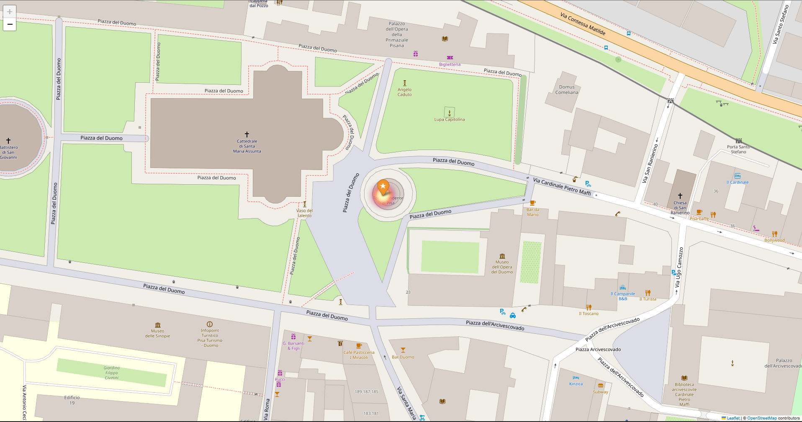

## Files Description
1. configuration: [config.yaml](./config.yaml)
2. Use multimodal LLM to inference: [infer.py](./infer.py)
3. Extract specific results(e.g.: latitude and longitude): [extract_info.py](./extract_info.py)
4. Use ChatGPT to check and refine the results: [check_GPT.py](./check_GPT.py)
5. Change prompt method: [method.py](./method.py)
6. Calculate distance between prediction and ground truth: [calc_dist.py](./calc_dist.py)
7. Automatic script: [run.py](./run.py)


## JSON File Description
```json
[
    {
        "image_file": "file_name",
        "gt": {
            "latitude": "value",
            "longitude": "value"
        },
        "model_1": {
            "method_1": {
                "output": " ",
                "latitude": " ",
                "longitude": " ",
                "location": " ",
                "xxx": " "
            }
        },
        "model_2": {
            "method_1": {
                "output": " ",
                "xxx": " "
            }
        },
    },
    ......
]
```

### Field Description

- `image_file`: The name of the image file.
- `gt`: A nested object containing geographical location information.
  - `latitude`: The latitude value.
  - `longitude`: The longitude value.
- `model_name`: A nested object containing model-related information.
  - `method`: A nested object containing method-related information.
    - `output`: The output result of the method.
    - `xxx`: Other relevant information.


### Demo
[View Interactive Map on local browser](./images/map.html)  
  
Feel free to run a simple demo:
```bash
python infer_demo.py --image-path /path/to/image
```
or [infer_demo.ipynb](./infer_demo.ipynb)


